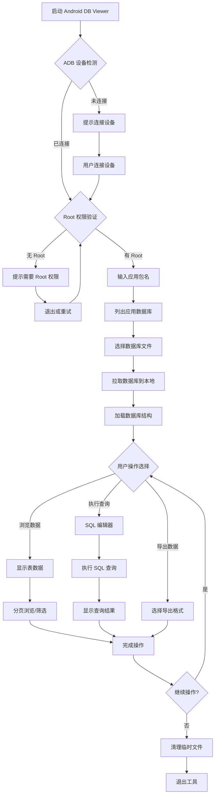
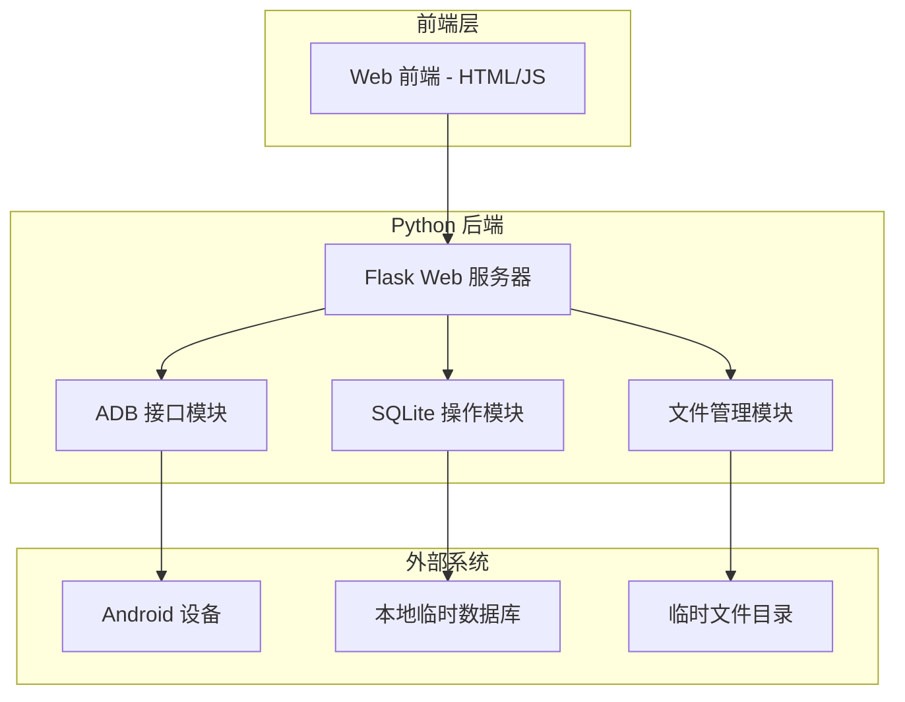

# Android DB Viewer - 产品规格文档

## 1. 产品概述
Android DB Viewer 是一个专为 Android 开发者设计的工具，帮助快速查看 Root 设备上的应用数据库。通过 ADB 连接和 Web 可视化界面，开发者可以便捷地浏览数据库结构、查看数据内容并执行自定义 SQL 查询。

目标用户：需要调试和分析 Android 应用数据的开发者，特别是拥有 Root 权限设备的开发者。

## 2. 核心功能

### 2.1 用户角色
| 角色 | 使用方式 | 核心权限 |
|------|----------|----------|
| Android 开发者 | 本地运行工具 | 连接 Root 设备、查看所有应用数据库、执行 SQL 查询 |

### 2.2 功能模块
工具包含以下核心功能：
1. **设备连接管理**：通过 ADB 连接 Root 过的 Android 设备
2. **应用数据库浏览**：列出指定应用的数据库文件
3. **数据库可视化**：Web 界面展示表结构和数据内容
4. **SQL 查询执行**：支持自定义 SQL 语句执行和结果展示
5. **数据导出**：支持将查询结果导出为常见格式

### 2.3 功能详情

| 功能模块 | 子功能 | 功能描述 |
|----------|--------|----------|
| 设备连接 | ADB 连接检测 | 自动检测设备连接状态，支持多设备选择 |
| 设备连接 | Root 权限验证 | 验证设备是否已获取 Root 权限 |
| 应用管理 | 包名输入 | 支持手动输入或从已安装应用列表选择 |
| 应用管理 | 数据库列表 | 显示 /data/data/<package>/databases/ 目录下的所有数据库文件 |
| 数据库操作 | 数据库拉取 | 利用 Root 权限将数据库文件复制到本地临时目录 |
| 数据库操作 | 表结构展示 | 以表格形式展示数据库中的所有表及其字段信息 |
| 数据库操作 | 数据浏览 | 分页展示表中数据，支持每页行数自定义 |
| 数据库操作 | SQL 查询 | 提供 SQL 编辑器，支持语法高亮和查询执行 |
| 数据库操作 | 查询结果 | 以表格形式展示查询结果，支持排序和筛选 |
| 数据导出 | 结果导出 | 支持将查询结果导出为 CSV、JSON 格式 |
| 数据导出 | 表结构导出 | 支持导出表结构为 SQL 脚本 |

## 3. 核心流程

### 3.1 主操作流程
```
启动工具 → 连接设备 → 选择应用 → 浏览数据库 → 查看数据/执行查询 → 导出结果
```

### 3.2 详细流程图


## 4. 用户界面设计

### 4.1 设计风格
- **主色调**：深蓝色 (#2c3e50) 搭配白色背景
- **强调色**：亮蓝色 (#3498db) 用于按钮和链接
- **字体**：系统默认字体，主要文字 14px，标题 18px
- **布局**：左侧导航栏 + 右侧主内容区域的经典布局
- **图标**：使用简洁的线性图标，符合开发工具风格

### 4.2 页面设计

| 页面模块 | UI 元素 | 设计说明 |
|----------|--------|----------|
| 设备连接页 | 设备列表下拉框 | 显示所有已连接的设备，支持刷新按钮 |
| 设备连接页 | Root 状态指示器 | 绿色图标表示已获取 Root，红色表示未获取 |
| 应用选择页 | 包名输入框 | 支持手动输入，右侧有搜索按钮 |
| 应用选择页 | 应用列表 | 显示设备上所有用户应用，支持搜索过滤 |
| 数据库列表页 | 文件树结构 | 树形结构展示 databases 目录下的文件 |
| 数据库列表页 | 文件信息 | 显示文件大小、修改时间等元信息 |
| 数据浏览页 | 表格组件 | 类似 Excel 的表格，支持列宽调整 |
| 数据浏览页 | 分页控件 | 底部显示页码导航，每页行数可配置 |
| SQL 编辑器页 | 代码编辑器 | 支持 SQL 语法高亮，有执行按钮 |
| SQL 编辑器页 | 结果显示区 | 下方显示查询结果或错误信息 |

### 4.3 响应式设计
- 桌面端优先设计，最小宽度 1024px
- 支持窗口大小调整，主要内容区域自适应
- 表格支持横向滚动，确保大数据量下的可用性

## 5. 技术架构

### 5.1 系统架构图


### 5.2 技术栈
- **后端**: Python 3.8+ + Flask 2.0+
- **前端**: HTML5 + JavaScript (原生) + Bootstrap 5
- **数据库**: SQLite3 (内置支持)
- **工具接口**: ADB (Android Debug Bridge)
- **依赖管理**: pip + requirements.txt

### 5.3 核心模块设计

#### 5.3.1 ADB 接口模块
```python
class ADBInterface:
    - connect_device(): 连接设备
    - check_root(): 验证 Root 权限
    - list_packages(): 获取应用列表
    - pull_database(): 拉取数据库文件
    - execute_shell(): 执行 shell 命令
```

#### 5.3.2 数据库操作模块
```python
class SQLiteManager:
    - connect_db(): 连接数据库
    - get_tables(): 获取所有表名
    - get_table_schema(): 获取表结构
    - execute_query(): 执行 SQL 查询
    - get_table_data(): 获取表数据
```

#### 5.3.3 Web 接口设计
| 接口路径 | 方法 | 功能描述 |
|----------|------|----------|
| / | GET | 主页，设备连接界面 |
| /api/devices | GET | 获取连接的设备列表 |
| /api/check-root | POST | 验证设备 Root 权限 |
| /api/packages | GET | 获取设备上的应用列表 |
| /api/databases | POST | 获取指定应用的数据库列表 |
| /api/pull-db | POST | 拉取数据库文件到本地 |
| /api/tables | GET | 获取数据库中的所有表 |
| /api/table-data | GET | 获取指定表的数据 |
| /api/execute-sql | POST | 执行自定义 SQL 查询 |
| /api/export | POST | 导出查询结果 |

## 6. 项目目录结构
```
android-db-viewer/
├── app.py                  # Flask 主应用
├── requirements.txt        # Python 依赖
├── config.py              # 配置文件
├── static/                # 静态资源
│   ├── css/              # 样式文件
│   │   └── style.css
│   ├── js/               # JavaScript 文件
│   │   ├── main.js
│   │   └── api.js
│   └── img/              # 图片资源
├── templates/             # HTML 模板
│   ├── index.html        # 主页
│   ├── devices.html      # 设备管理
│   ├── packages.html     # 应用选择
│   ├── databases.html    # 数据库列表
│   ├── table_view.html   # 数据浏览
│   └── sql_editor.html   # SQL 编辑器
├── modules/               # 核心模块
│   ├── __init__.py
│   ├── adb_interface.py  # ADB 接口
│   ├── db_manager.py     # 数据库管理
│   ├── file_manager.py   # 文件管理
│   └── utils.py          # 工具函数
├── temp/                  # 临时文件目录
│   └── .gitkeep
└── logs/                  # 日志文件
    └── .gitkeep
```

## 7. 部署和运行

### 7.1 环境要求
- Python 3.8 或更高版本
- ADB 工具已安装并配置环境变量
- Android 设备已开启 USB 调试
- 设备已获取 Root 权限

### 7.2 安装步骤
1. 克隆项目到本地
2. 安装 Python 依赖：`pip install -r requirements.txt`
3. 确保 ADB 可用：`adb devices`
4. 运行应用：`python app.py`
5. 打开浏览器访问：`http://localhost:5000`

### 7.3 配置选项
- 临时文件存储路径
- 每页显示数据行数
- SQL 查询超时时间
- 日志级别和存储位置

## 8. 安全和权限

### 8.1 安全考虑
- 仅用于开发调试目的
- 不在生产环境使用
- 临时文件及时清理
- SQL 注入防护

### 8.2 权限要求
- Android 设备需要 Root 权限
- 本地运行需要文件系统读写权限
- 网络访问权限（Web 服务）

## 9. 扩展功能（未来规划）
- 支持多种数据库格式（MySQL、PostgreSQL）
- 数据对比和同步功能
- 数据可视化图表
- 批量操作和脚本执行
- 多语言界面支持